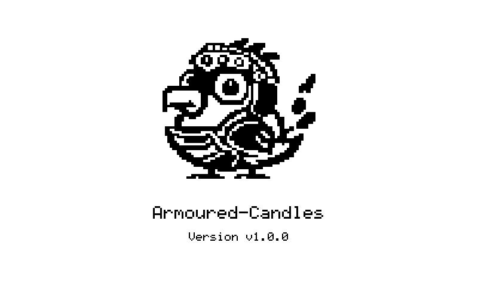

# armoured-candles

A self-refreshing multi-exchange cryptocurrency candlestick chart for a Waveshare 7.5" V2 e-paper display (800×480), driven by a Seeed XIAO ESP32-S3.

The firmware fetches OHLCV data, renders candles + indicators into a 1-bit framebuffer, and serves a full browser-based control panel for configuration, preview, and OTA updates.



## What's New

Compared to early versions, the project now includes:

- **Multi-exchange data support**: Hyperliquid, Binance, AsterDEX, Kraken, and Poloniex
- **Searchable coin picker** with exchange-specific pair loading
- **Heikin Ashi mode** toggle
- **Live display preview** in the web UI (`/api/display` bitmap stream)
- **Browser OTA firmware updates** (`/api/update`)
- **Improved WiFi recovery** with STA reconnect, ghost-link resets, and AP fallback

## Features

- **Candlestick charts on e-paper** with OHLCV overlays
- **Indicators**: EMA fast/slow, RSI, and volume bars
- **Exchange-aware intervals** with auto candle count scaling
- **Heikin Ashi rendering** (optional)
- **Web config UI** at `http://epdchart.local` (or device IP)
- **Persistent settings** in ESP32 NVS flash
- **Partial/full refresh strategy** to balance ghosting vs. speed
- **mDNS + AP fallback setup flow**
- **In-browser OTA firmware upload/install**

## Hardware

| Component | Model |
|-----------|-------|
| MCU | Seeed XIAO ESP32-S3 |
| Display | Waveshare 7.5" V2 (800×480 B/W), GDEY075T7 |
| Driver HAT | Waveshare e-Paper Driver HAT Rev 2.3 |
| Power | Stable 5V USB supply to the XIAO |

## Wiring

> **Important:** For the Rev 2.3 HAT, both **PWR** and **VCC** should be tied to **3.3V**. Using 5V on VCC can cause SPI corruption/snow.

| HAT Pin | XIAO S3 Pin | GPIO |
|---------|-------------|------|
| PWR | 3V3 | — |
| VCC | 3V3 | — |
| GND | GND | — |
| CLK | D8 | GPIO7 (SCK) |
| DIN | D10 | GPIO9 (MOSI) |
| CS | D1 | GPIO2 |
| DC | D2 | GPIO3 |
| RST | D3 | GPIO4 |
| BUSY | D4 | GPIO5 |

**HAT switch config:** Display `B`, Interface `0` (4-wire SPI)

## Arduino IDE Setup

1. Install **ESP32 by Espressif Systems** board package (3.x recommended)
2. Select board: **XIAO_ESP32S3**
3. Enable **PSRAM**: `OPI PSRAM`
4. Install library: **ArduinoJson** (Library Manager)

## First Boot / Provisioning

1. Flash `armoured-candles.ino`
2. Device shows splash while attempting WiFi STA connect
3. If WiFi is missing/invalid, device starts AP: **EPDChart-Setup**
4. Join AP and open `http://192.168.4.1`
5. Enter WiFi + chart settings and save
6. Device reboots and starts normal chart refresh cycle

## Web UI

Open: `http://epdchart.local` (or the local IP)

### Sections

- **Display Preview**
  - Live image from `/api/display`
  - Auto refreshes in the browser
- **Chart**
  - Exchange, coin search/select, interval
  - Auto/manual candle count
  - Heikin Ashi toggle
  - Refresh interval
- **Indicators**
  - EMA fast/slow
  - RSI period
- **Display**
  - Full refresh cadence
  - Partial refresh threshold
  - Timezone offset
- **WiFi**
  - SSID/password updates
- **Firmware Update**
  - Upload compiled `.bin` and install OTA
- **Actions**
  - Save config, force refresh, reboot

## Supported Exchanges

- Hyperliquid
- Binance
- AsterDEX
- Kraken
- Poloniex

The UI fetches tradable pairs per exchange directly in the browser, then stores the selected base coin symbol in device config.

## Interval Support

Intervals are exchange-aware and constrained by each provider. Common intervals include:

`1m, 3m, 5m, 15m, 30m, 1h, 2h, 4h, 6h, 8h, 12h, 1d, 3d, 1w, 1M`

> Note: not every exchange supports every interval (the UI dynamically updates options).

## Configuration Defaults

Stored in NVS (`Preferences` namespace `epdchart`):

| Setting | Default | Range/Notes |
|---------|---------|-------------|
| Exchange | `hyperliquid` | one of supported exchanges |
| Coin | `ETH` | exchange-dependent |
| Interval | `5m` | exchange-dependent |
| Auto candles | `true` | auto map by interval |
| Manual candles | `60` | 5–200 |
| Refresh | `5` min | 1–60 |
| EMA fast | `9` | 2–100 |
| EMA slow | `21` | 2–200 |
| RSI period | `14` | 2–100 |
| Timezone offset | `0` sec | UTC offset |
| Full refresh every | `10` cycles | 1–50 |
| Partial threshold | `40%` | 10–100 |
| Heikin Ashi | `false` | on/off |

## Auto Candle Map

| Interval | Candles |
|----------|---------|
| 1m | 120 |
| 3m | 80 |
| 5m | 60 |
| 15m | 48 |
| 30m | 48 |
| 1h | 48 |
| 2h | 42 |
| 4h | 42 |
| 8h | 30 |
| 12h | 30 |
| 1d | 30 |
| 3d | 20 |
| 1w | 26 |
| 1M | 12 |

## Network Resilience

- Periodic WiFi health checks
- Consecutive fetch failure tracking
- "Ghost" connection recovery via WiFi radio reset
- AP fallback mode while still retrying STA
- Status messaging on e-paper during outages

## HTTP Endpoints

- `GET /` — Web UI
- `GET /api/status` — current runtime + config snapshot
- `POST /api/config` — save config
- `POST /api/refresh` — force redraw/update
- `POST /api/restart` — reboot device
- `GET /api/display` — current framebuffer as BMP
- `POST /api/update` — OTA firmware upload

## Project Structure

```text
armoured-candles/
├── armoured-candles.ino  # Main firmware: UI, WiFi, APIs, chart + indicators
├── epd7in5_V2.cpp/.h     # Waveshare 7.5" V2 driver (full + partial refresh)
├── epdif.cpp/.h          # Low-level SPI transport glue
├── splash_image.h        # Boot splash bitmap
└── docs/
    └── splash_preview.png
```

## Known Notes

- Rev 2.3 HAT reset pin is reset-only (not hard power gate)
- PSRAM should be enabled for comfortable JSON/runtime headroom
- mDNS discovery can vary by client/network (use IP if needed)
- Partial refresh artifacts are expected over time; periodic full refresh clears them

## License

MIT
